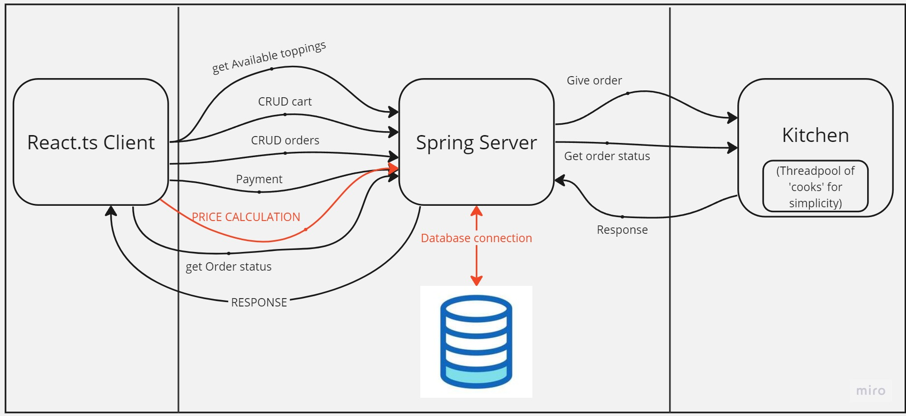

# Pizzeria app

Fullstack project for pizzeria.

## Solves problems
An application was created for a pizzeria to automate these processes:
- accepting orders,🚩
- creating a custom pizza and, accordingly, custom calculating its price on the backend,🤑
- tracking the readiness of the order (a timer that is checked with the kitchen),🕒
- viewing previous orders 🔍

## Built With

- Java 17 
- Spring Boot
- Spring Security
- Concurrency
- JWT
- PostgresSQL
- Lombok

## Architecture

<h2>Frontend Part</h2>

<a href="https://github.com/SehiiSterniichuk/pizza-calculator">Repository Link</a>